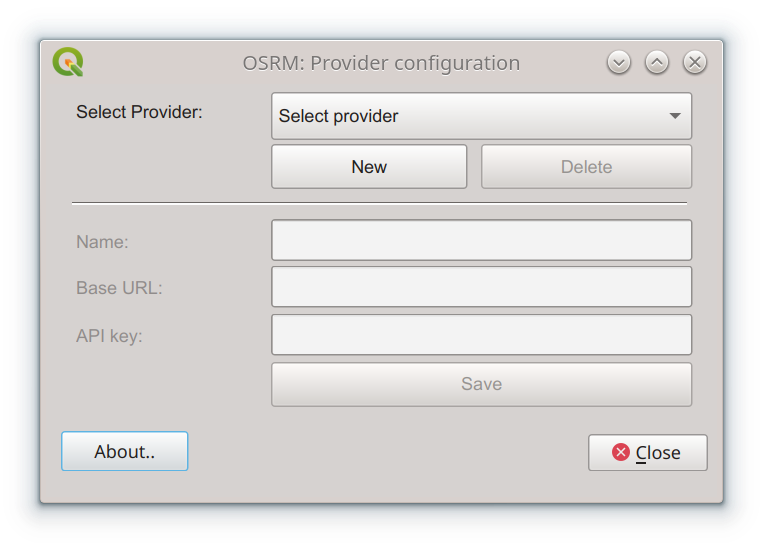
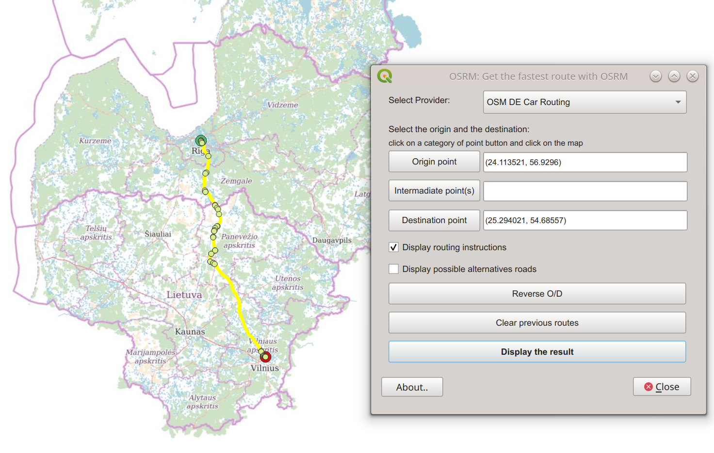

**OSRM Routing plugin for QGIS >=3.28**

Routing with OSRM
=================
This plugin is available for QGIS version >=3.28 and is under active development.
Plugin source code is available at https://github.com/strues-maps/qgis_osrm .
This plugin is licensed under GNU GPL v2.0 or later.

This plugin was developed by porting relevant parts from osrm-qgis-plugin for
QGIS2 by Matthieu Viry. QGIS2 plugin was available at https://github.com/mthh/osrm-qgis-plugin .

Prepare environment
===============================
User environment uses the following packages:
```
sudo apt install python3-scipy python3-matplotlib python3-numpy python3-shapely python3-qgis
```

Development environment uses the following packages:
```
sudo apt install qttools5-dev-tools pyqt5-dev-tools pylint pycodestyle python3-scipy python3-matplotlib python3-numpy python3-shapely python3-qgis
sudo pip install qgis-plugin-ci --break-system-packages
```

Examples
========
Images of this page are displayed on OpenStreetMap tiles (© OpenStreetMap contributors) and route computations were done with Open Source Routing Machine.

Set up a provider configuration
------------
**Change the provider configuration used by the OSRM plugin. There are a few provider urls available in the default plugin installation:**

- Local OSRM at port 5000 (used if OSRM is manually installed on localhost)

- OSM DE Bike Routing (used at https://project-osrm.org demo as bike routing OSRM instance)

- OSM DE Foot Routing (used at https://project-osrm.org demo as foot routing OSRM instance)

- OSM DE Car Routing (used at https://project-osrm.org demo as a car routing OSRM instance)

- Strues-Maps Routing (used by https://strues-maps.lt registered users)

Add new provider urls in the configuration window or edit/delete existing providers. Provider urls should work
out of the box, except for "Strues-Maps Routing", which requires setting the API key that users receive
during registration. 



Find a route
------------
**Display a simple route from OSRM (with support of viapoints, alternative roads, and route instructions)**:

Request a route calculation from the point of origin to the point of destination by clicking on the
*[Origin point]* button and clicking on the map, by clicking on the *[Destination point]* button and clicking on the map, and
optionally by clicking on the *[Intermadiate point]* button and clicking on the map. In case there are multiple intermadiate points,
click on the *[Intermadiate point]* button before each point. Marking "Display routing instructions" will create an additional
instructions layer that contains an attribute table with routing instructions. Marking "Display possible alternative
roads" will include alternative roads in the route layer.



Fetch a time-distance matrix
----------------------------
**Get a time matrix from one (or between two) QGIS point layer(s)**:


Compute accessibility isochrones
--------------------------------
**Compute monocentric or polycentric accessibility isochrones**:


Compute many *viaroute*
-----------------------
**Retrieve many routes between two QGIS layer of points**:


Display the solution of the Travelling Salesman Problem
-------------------------------------------------------
**Display the result of the Travelling Salesman Problem computed by OSRM**:


Found a bug?
===================================
If you found a bug, feel free to report it at https://github.com/strues-maps/qgis_osrm/issues


Commercial support and improvements
===================================

In case you need commercial support for this plugin, feel free to contact current
developer via e-mail at info@strues-maps.lt, subject - qgis osrm plugin.