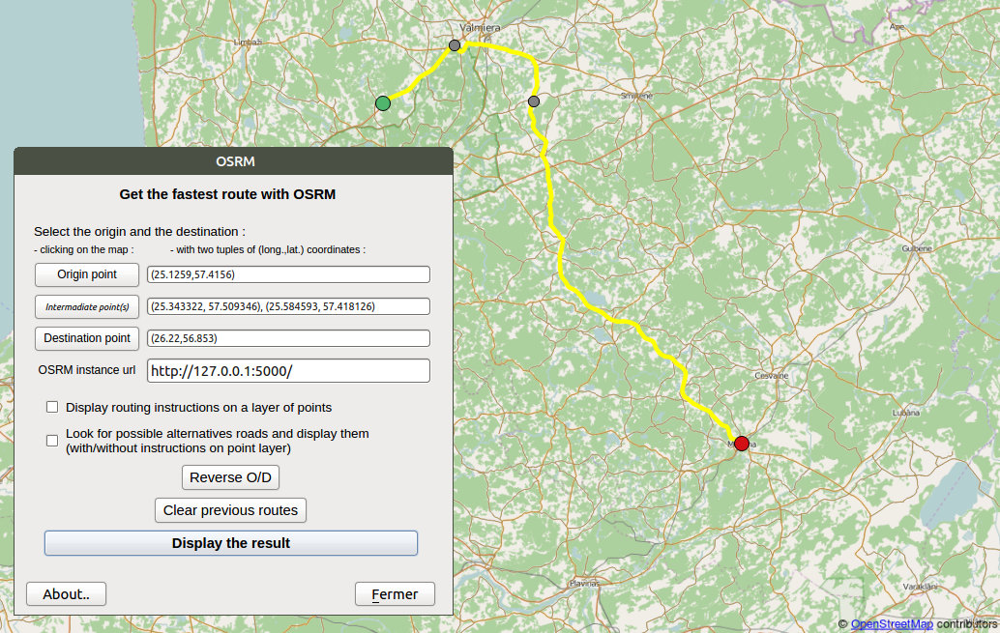
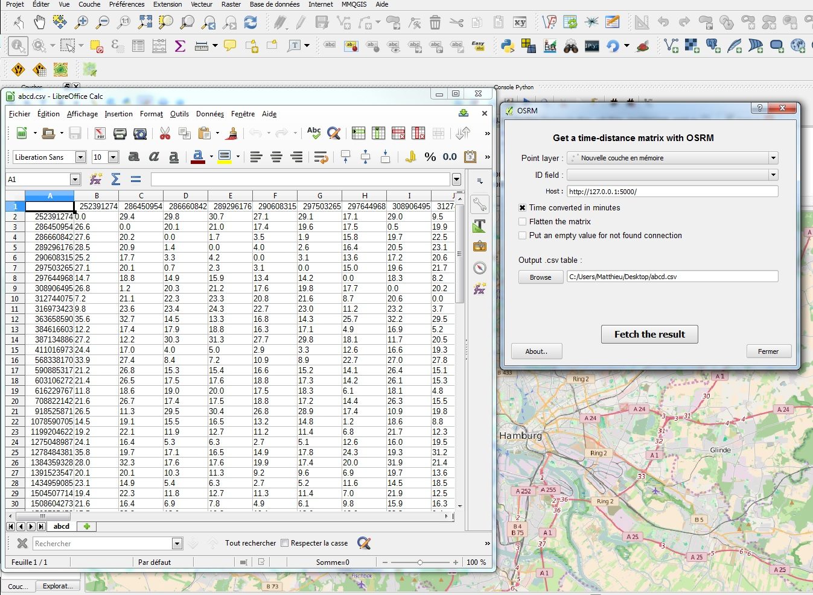
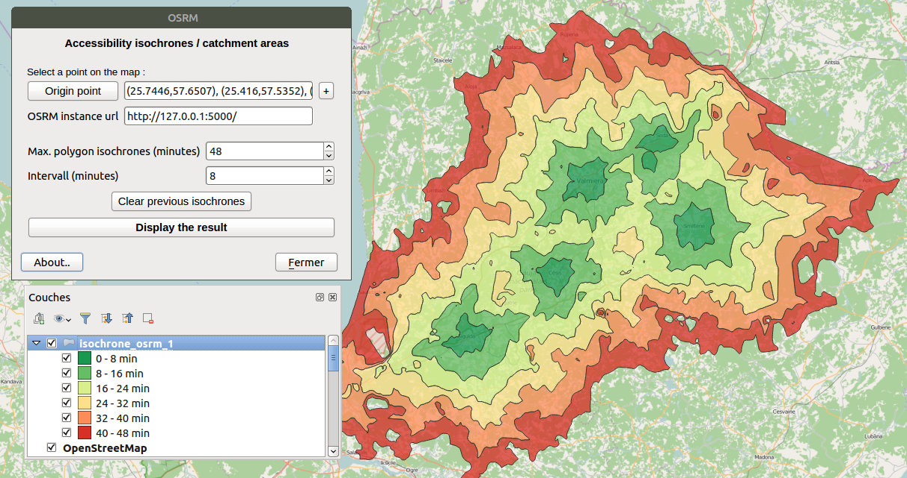
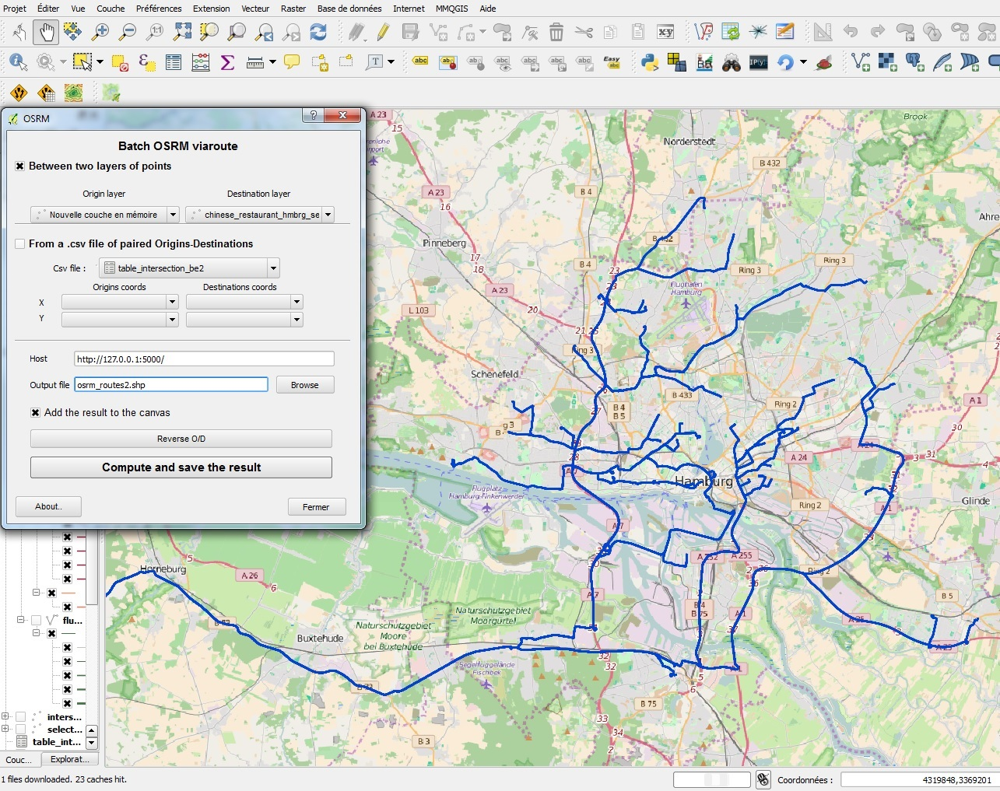
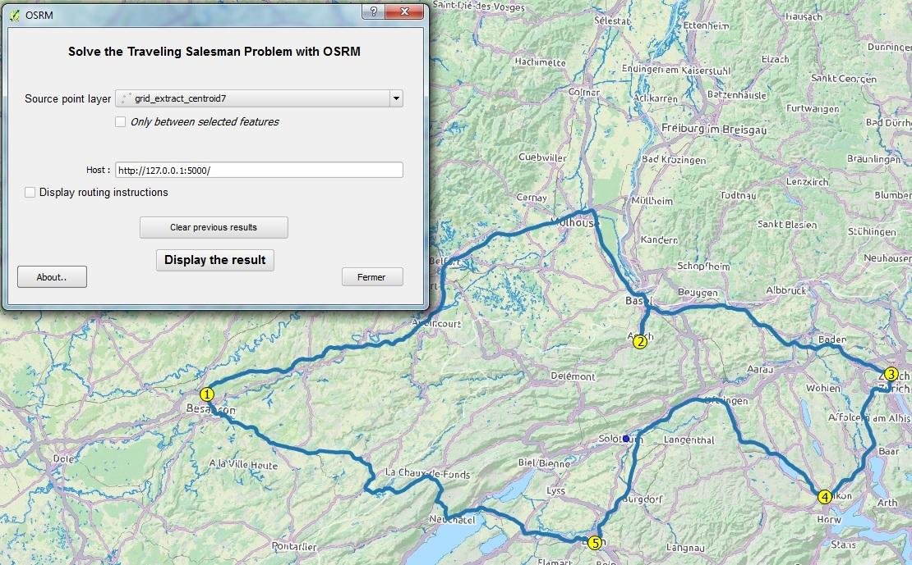

**OSRM Routing plugin for QGIS 3.44**

Routing with OSRM
=================
This plugin is available for QGIS version 3.44 and is under active development.
Plugin source code is available at https://github.com/strues-maps/qgis_osrm .
This plugin is licensed under GNU GPL v2.0 or later.

This plugin was developed by porting relevant parts from osrm-qgis-plugin for
QGIS2 by Matthieu Viry. QGIS2 plugin was available at https://github.com/mthh/osrm-qgis-plugin .

TODO
====
- write units tests

PREPARE RUNTIME ENVIRONMENT
===============================
```
sudo apt install install python3-scipy
```

PREPARE DEVELOPMENT ENVIRONMENT
===============================
```
sudo apt install qttools5-dev-tools pyqt5-dev-tools pylint pycodestyle python3-scipy python3-matplotlib python3-numpy python3-shapely python3-qgis
sudo pip install qgis-plugin-ci --break-system-packages
```

EXAMPLES
========
Images of this page are displayed on OpenStreetMap tiles (© OpenStreetMap contributors) and route computations were done with Open Source Routing Machine.

Find a route
------------
**Display a simple route from OSRM (with support of viapoints, alternatives roads and route instructions)**:



Fetch a time-distance matrix
----------------------------
**Get a time matrix from one (or between two) QGIS point layer(s)**:



Compute accessibility isochrones
--------------------------------
**Compute monocentric or polycentric accessibility isochrones**:



Compute many *viaroute*
-----------------------
**Retrieve many routes between two QGIS layer of points**:



Display the solution of the Travelling Salesman Problem
-------------------------------------------------------
**Display the result of the Travelling Salesman Problem computed by OSRM**:




FOUND A BUG?
===================================
If you found a bug, feel free to report it at https://github.com/strues-maps/qgis_osrm/issues


COMMERCIAL SUPPORT AND IMPROVEMENTS
===================================

In case you need commercial support for this plugin, feel free to contact current
developer via e-mail at info@strues-maps.lt, subject - qgis osrm plugin.